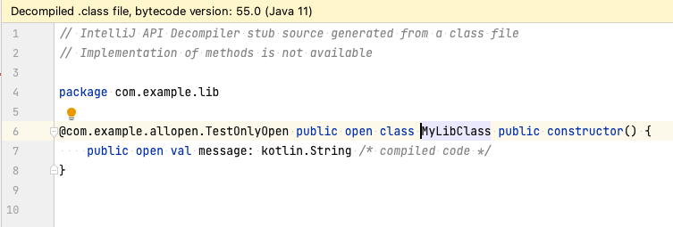

# Java variants with Android

This is a sample application to show how to use different variants of Java/Kotlin modules with Android flavours.

The configuration is not straightforward and some configurations does not allow the IDE to resolve a different Java/Kotlin module than the `main` one.

After [raising a bug in the Google Issue Tracker](https://issuetracker.google.com/issues/268432140) I managed to configure a Java/Kotlin module with 2 variants and allow the IDE resolve the source code when targeting both variants.

🚨 Be aware that you need to compile the project first in order for the IDE to resolve the source code. This is because the IDE needs the generated second variant `jar` in the `build` directory.

This project is also a showcase to use the `all-open` Kotlin plugin with Java/Kotlin modules and Android modules

# How to test

To test if the classes are opened in the `staging` flavour, run the application in the `stagingDebug` build variant. You'll see that the message is `Opened MyLibClass`.

To check the app with the closed variant, just run the `productionDebug` build variant. You'll see the message `Closed MyLibClass`.

# Known issues

In terms of execution, everything works as expected. Each flavour uses the correct java module variant.

The problem is that the IDE uses the `main` java module sourceset when the `production` flavour is selected. In this case, everything works well in the IDE.

But when using the `staging` flavour, we are using the `secondConfiguration` generated `.jar` (`lib/build/libs/lib-secondConfiguration.jar`).

That has 2 downsides:

- The classes from the jar are not resolved until the jar is generated. The task `lib:secondConfigurationJar` needs to be executed.
- When you navigate to the java source code when using the `staging` flavour, the classes are opened from the jar, and not from the source code. Thus making the navigation very difficult as you cannot use `Go To Declaration (CMD + B)` to navigate to the source code.

